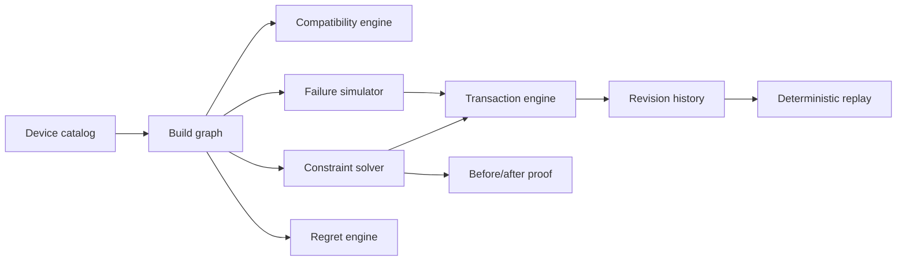

# Build Lab Architecture

## Problem Statement

ByteBazaar Build Lab is not a recommendation widget. It is an explainable engineering workspace that models developer gear as a graph, evaluates compatibility rules, solves constraints, simulates failures, measures regret, and commits changes through a transactional engine.

## Why This Is Not a Normal Recommender

- The system reasons over devices, ports, power budgets, display paths, and future requirements.
- It can explain why a build is valid, invalid, fragile, or expensive later.
- It previews, verifies, commits, undoes, redoes, and replays build mutations deterministically.

## System Architecture

## Data Flow

1. Catalog devices are selected into the graph.
2. Compatibility and health are evaluated.
3. Solver builds ranked strategies and conflict radar.
4. Auto-fix, recovery, or strategy previews become transactions.
5. Transactions are validated, committed, and recorded with proof.
6. Undo/redo restores exact previous snapshots.

## Device Knowledge Model

- Typed device categories and connector capabilities
- Power input/output, bandwidth, refresh rate, and dimensions
- Workload tags and upgradeability hints

## Graph Model

- Nodes represent selected devices
- Edges represent deterministic relationships
- Graph operations remain immutable

## Compatibility Rules

- Connector compatibility
- Display path and bandwidth
- Dock power delivery
- Host OS support
- Orphan detection

## Solver Strategy

- Cheapest
- Balanced
- Future-proof

Each strategy is derived from the same graph and constraints.

## Conflict Aggregation

- Hard violations
- Soft tradeoffs
- conflict radar items
- ranked fix suggestions

## Auto-Fix Verification

- Plans are converted into typed transactions
- Transactions are previewed against the current revision
- Apply succeeds only if verification confirms acceptable outcome

## Failure Propagation

- Downstream dependency traversal
- Blast radius tracing
- Recovery option generation

## Criticality

- Direct dependents
- Transitive dependents
- Route count
- Hard constraint risk

## Regret Model

- Future scenarios
- Cost of replacement later
- Reuse potential
- Upgrade friction

## Timeline Model

- Scenario horizon projection
- Spend evolution
- replacement waste
- reuse rate

## Transaction Engine

- Typed operations
- Atomic apply
- Stale revision rejection
- Undo/redo
- Deterministic replay

## Revision / Undo / Redo

- Every commit increments revision
- Undo restores the previous snapshot
- Redo reapplies the committed snapshot

## Deterministic Explainability

- All outputs are derived from local typed data
- No model inference or fake prose
- Proof panels use actual engine results

## Complexity and Tradeoffs

- Transaction apply is linear in operation count and graph size
- Replay is linear in committed history length
- Snapshot-based undo/redo is simple and safe

